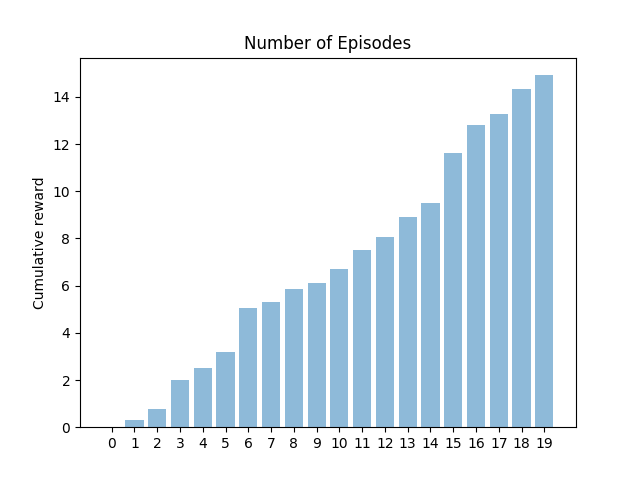
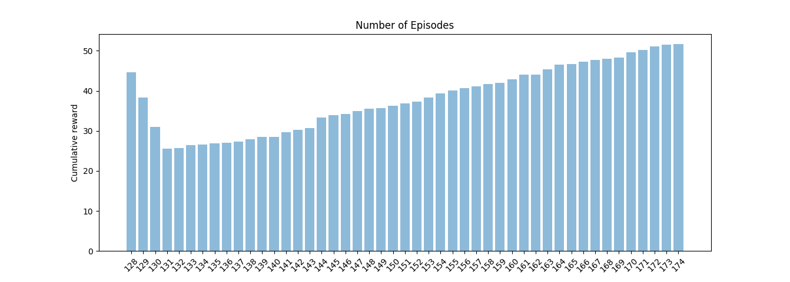
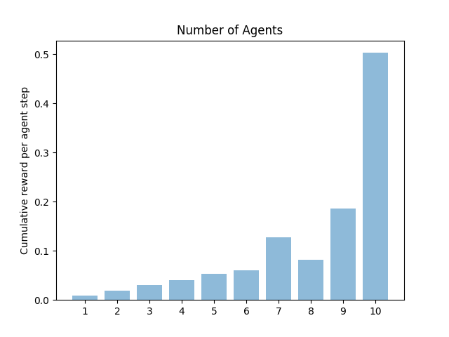

# kindredRL
Implements Q learning based Reinforcement Learning.

## Running the code

The ```run.py``` file contains code for running both synchronous and asynchronous Q learning. You
can run the code as follows:

```
python run.py
```

This will invoke the synchronous algorithm with reasonable defaults. However, you can pass in values
using flags as follows:

```
python run.py --episodes 1000 --epsilon 0.6 --alpha 0.2 --gamma 0.9
```

To run the asynchronous version, you can pass in the ```--async``` flag:

```
python run.py --async
```

Again, this will start the multiprocessing based Q learning algorithm with reasonable defaults,
however you can pass in values for parameters as follows:

```
python run.py --async --agents 5 --iasync 10 --tmax 10000 --epsilon 0.6 --alpha 0.2 --gamma 0.9
```

In all cases, the code will return the learned Q matrix.

## Running Tests

When run from the base directory, the following command will trigger all tests under the ```tests```
directory:

```
python -m pytest
```

## Results

This section details the results based on the implementation of the given algorithms.

### Part 1

The following graph shows the cumulative reward plotted against number of episodes that the
algorithm went through (below 5000 steps).



As you can see, the cumulative reward goes up with each successive episode.


The next graph shows learning in terms of cumulative reward after the grid switches to the updated
version (above 5000 steps).



The cumulative reward decreases in the immediate aftermath of the switch, but the agent quickly
recovers and adapts to the new grid layout, resulting in an increase in the cumulative reward.

### Part 2

The following graph shows the correlation between average cumulative reward per agent step, plotted
against the number of agents used.



As evident from the graph, there is a linear correlation between cumulative reward and number of
agents used.
